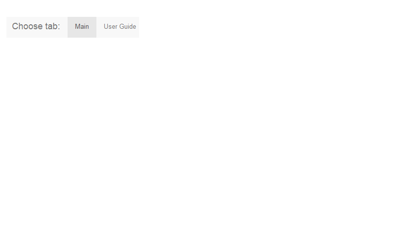
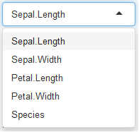
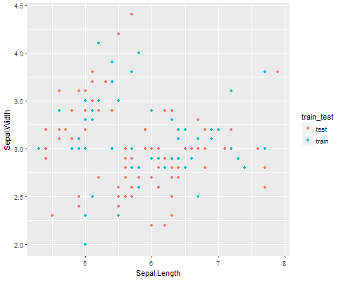
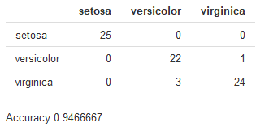

<style>
.title-slide {
  background-color: #FFFFFF; /* #EDE0CF; ; #CA9F9D*/
}
</style>

## Introduction

- The app created for this project is one that enables the user to explore the use
of random forest classification models to predict the species of observations in
the iris data set.

- The app lets the user see how varying training and test data set sizes, and
number of trees used in the model affects the accuracy of the model.

## Tabs

- The app user interface is found on the 'Main' tab, and a brief user guide is found on the 'User Guide' tab:
<div style='text-align: center;'>
    
</div>

--- .class #id 

## The Sidebar

<div class="top">
    TOP
</div>
<div class="left">
    
</div>
<div class="main">
    <ul>
    <li>The sidebar allows the user to choose several inputs to the server calculations and rendering, including:</li>
    </ul>
    <ol>
    <li>How to split the training and test sets</li>
    
    <li>Which variables to visualise on the plot x and y axes to see which data points are allocated to each data set</li>
    
    <li>How many trees to use when building the random forest regressor</li>
    </ol>
    <ul>
    <li>The user's input will only be used when the "Build & Run Model!" button is clicked</li>
    </ul>
</div>

--- .class #id

## The Drop-down Menus

- The drop-down menus allow the user to input their choice of variables to be plotted on the x and y axes. The options are the iris data set features.

<div class="row"> 
  <div class="column">
    
  </div>
  <div class="column">
    
  </div> 
</div>

--- .class #id

## The Output

- The ouput is a confusion matrix showing the results of the model's classification of the species in the test data set as well as an accuracy score of correctly classified species:

<div class="row"> 
  <div class="column">
    
  </div>
</div>

- The columns are the actual species of the test observations and the rows show how each were classified by the model

- Example accuracy calculation, 4 species misclassified out of 75 observations:

```{r, eval=TRUE, echo=TRUE}
1 - 4/75
```
